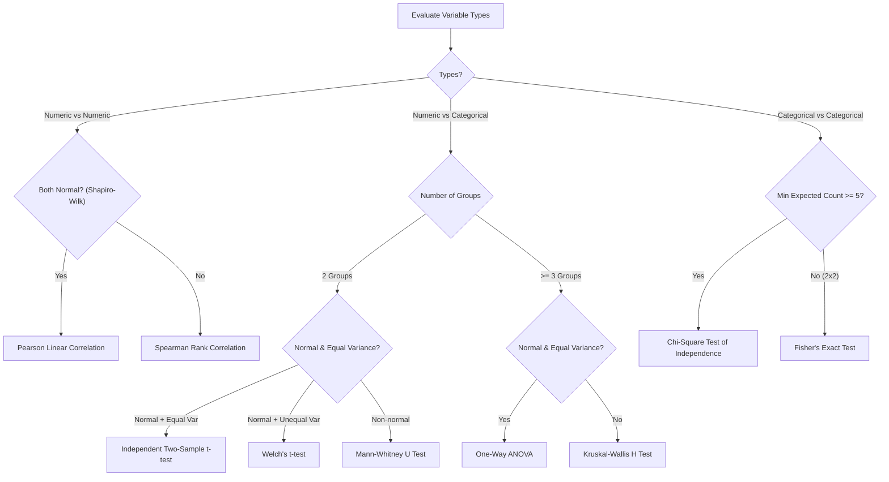

# Statistical Testing Decision Tree

Athena deterministically selects hypothesis tests via `recommend_test` based on empirical distribution properties.

## Decision Flow

```mermaid
flowchart TD
    Start["Evaluate Variable Types"] --> CheckType{"Types?"}
    
    CheckType -- "Numeric vs Numeric" --> NormNum{"Both Normal? (Shapiro-Wilk)"}
    NormNum -- Yes --> Pearson["Pearson Linear Correlation"]
    NormNum -- No --> Spearman["Spearman Rank Correlation"]

    CheckType -- "Numeric vs Categorical" --> Groups{"Number of Groups"}
    Groups -- "2 Groups" --> Norm2{"Normal & Equal Variance?"}
    Norm2 -- "Normal + Equal Var" --> TTest["Independent Two-Sample t-test"]
    Norm2 -- "Normal + Unequal Var" --> Welch["Welch's t-test"]
    Norm2 -- "Non-normal" --> MannWhitney["Mann-Whitney U Test"]

    Groups -- ">= 3 Groups" --> NormK{"Normal & Equal Variance?"}
    NormK -- "Yes" --> ANOVA["One-Way ANOVA"]
    NormK -- "No" --> Kruskal["Kruskal-Wallis H Test"]

    CheckType -- "Categorical vs Categorical" --> ExpCell{"Min Expected Count >= 5?"}
    ExpCell -- Yes --> Chi2["Chi-Square Test of Independence"]
    ExpCell -- "No (2x2)" --> Fisher["Fisher's Exact Test"]
```
